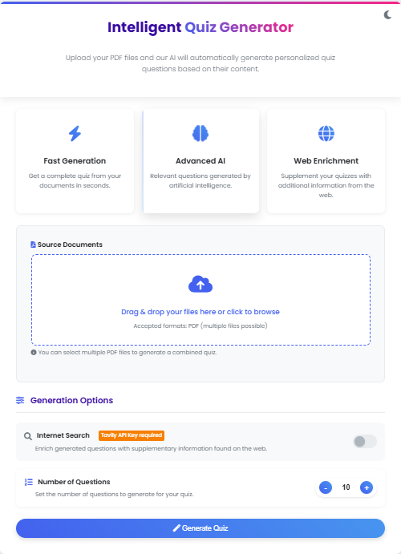
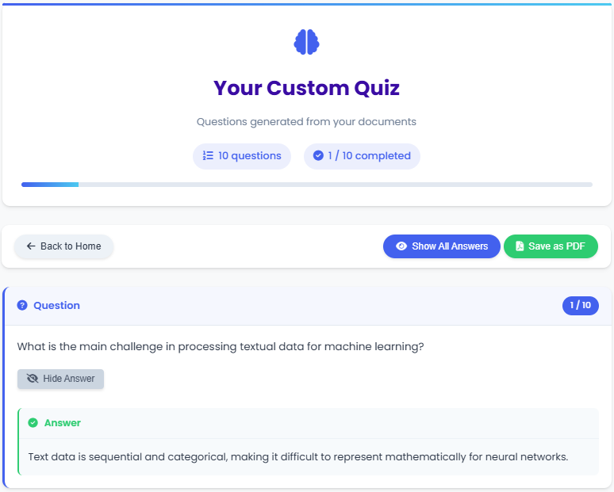
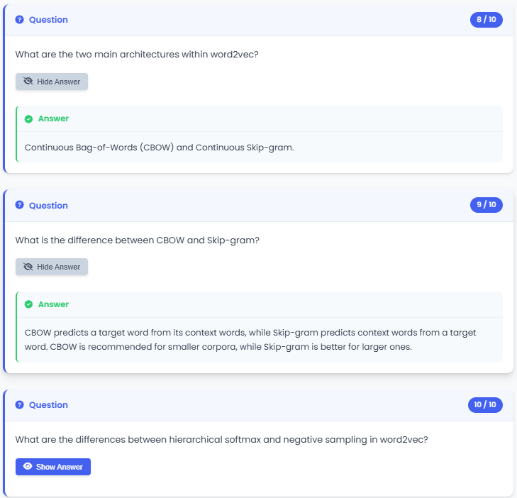

# QuizGenius 🧠 | AI-Powered PDF Quiz Generator


</div>

## 💫 Project Overview

**QuizGenius** transforms PDF documents into interactive quizzes using advanced AI. Perfect for students, educators, and trainers looking to create relevant assessments in just a few clicks.

Built with cutting-edge AI technology (Google Gemini + LangChain + RAG), QuizGenius understands your documents and generates high-quality contextual Q&A effortlessly.

## ✨ Key Features

- 📄 **Multi-PDF Analysis** - Upload multiple documents simultaneously
- 🤖 **Advanced AI Generation** - Relevant questions powered by Google Gemini Pro
- 🎯 **Contextual Accuracy** - RAG technology with FAISS vector search
- 🌐 **Web Enrichment** - Optional internet search via Tavily to complement quizzes
- 🎨 **Intuitive Interface** - Responsive design with light/dark theme
- 💾 **Auto-Save Progress** - Remember your quiz progress between sessions
- 📱 **Responsive Design** - Use on any device
- 📥 **PDF Export** - Download quizzes for offline review

## 🖼️ Screenshots

<div align="center">
  
  
  

</div>

## 🧰 Technology Stack


- **Backend**: Python 3.12+, Flask
- **Frontend**: HTML5, CSS3, JavaScript
- **AI & Orchestration**: Google Generative AI (Gemini Pro), LangChain, LangGraph
- **Vector Database**: FAISS for efficient similarity search
- **PDF Processing**: PyMuPDF (fitz)
- **Export**: html2pdf.js

## 🚀 Quick Start

### Prerequisites

- Python 3.12 or higher
- [Google Gemini API Key](https://ai.google.dev/) (Required)
- [Tavily API Key](https://tavily.com/) (Optional, for internet search)

### Installation

```bash
# Clone the repository
git clone https://github.com/anass1209/Intelligent-Quiz-Generator.git
cd Intelligent-Quiz-Generator

# Method 1: Using Poetry (Recommended)
poetry install
# Run the application with first method
cd src
poetry run python app.py


# Method 2: Using pip
python -m venv venv
source venv/bin/activate  # On Windows: venv\Scripts\activate
pip install -r requirements.txt
# Run the application with second method
cd src
python app.py

```

Then open your browser to `http://127.0.0.1:5010`

## 📋 Usage Guide

1. **Configure API Keys**: Enter your Google Gemini API key on first launch
2. **Upload PDFs**: Drag & drop or select files for analysis
3. **Set Options**: Choose question count and enable/disable web search
4. **Generate Quiz**: Click "Generate Quiz" to start the AI process
5. **Interact**: Answer questions, reveal answers, track progress
6. **Export**: Save as PDF for offline use or sharing

## 🔄 How It Works

QuizGenius uses a sophisticated AI pipeline to process your documents:

1. **PDF Processing**: Extract text content from PDF documents
2. **Text Chunking**: Divide text into meaningful semantic chunks
3. **Vector Embedding**: Convert text chunks into numerical vectors
4. **Knowledge Retrieval**: Use FAISS to find the most relevant content
5. **Web Augmentation**: Optional enhancement with real-time web data
6. **Quiz Generation**: Apply LLM reasoning to create tailored Q&A
7. **Interactive Display**: Present results in a user-friendly interface

## 🔍 Use Cases

- **Students**: Create study materials from lecture notes and textbooks
- **Teachers**: Generate assessments from course materials
- **Corporate Trainers**: Develop quizzes from training manuals
- **Researchers**: Test comprehension of academic papers
- **Self-learners**: Reinforce knowledge from any PDF content

## 🤝 Contributing

Contributions are welcome! Please feel free to submit a Pull Request.

1. Fork the repository
2. Create your feature branch (`git checkout -b feature/amazing-feature`)
3. Commit your changes (`git commit -m 'Add some amazing feature'`)
4. Push to the branch (`git push origin feature/amazing-feature`)
5. Open a Pull Request

## 📄 License

This project is licensed under the MIT License - see the [LICENSE](LICENSE) file for details.

## 🙏 Acknowledgements

- [Google Generative AI](https://ai.google.dev/)
- [LangChain](https://www.langchain.com/)
- [Flask](https://flask.palletsprojects.com/)
- [FAISS](https://github.com/facebookresearch/faiss)
- [PyMuPDF](https://github.com/pymupdf/PyMuPDF)

---

<div align="center">

⭐ **Star this repo if you find it useful!** ⭐

[Report Bug](https://github.com/anass1209/Intelligent-Quiz-Generator/issues) · [Request Feature](https://github.com/anass1209/Intelligent-Quiz-Generator/issues)

</div>