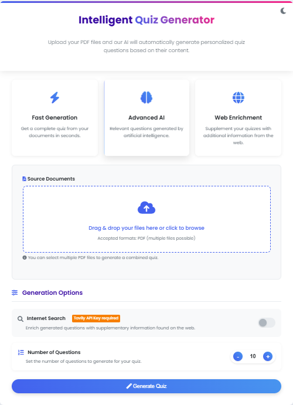

# Intelligent Quiz Generator

An AI-powered application that automatically generates quizzes from PDF documents using Google's Gemini API and LangChain.



## Features

- **PDF Processing**: Upload one or multiple PDF files
- **AI-Generated Questions**: Automatically creates relevant quiz questions and answers
- **Web Enrichment**: Optional enhancement of quiz content using web search (via Tavily API)
- **PDF Export**: Export quizzes directly to PDF format
- **Interactive UI**: Modern, responsive interface with dark/light theme support
- **Progress Tracking**: Tracks which questions you've viewed answers for

## Technology Stack

- **Backend**: Python, Flask
- **Frontend**: HTML5, CSS3, JavaScript
- **AI & ML**: Google Generative AI (Gemini), LangChain
- **PDF Processing**: PyMuPDF (fitz)
- **Graph-based RAG Pipeline**: LangGraph

## Prerequisites

- Python 3.10+
- Google Gemini API key
- Tavily API key (optional, for web search functionality)

## Installation

### Using Poetry (Recommended)

1. Clone the repository:
   ```bash
   git clone https://github.com/yourusername/intelligent-quiz-generator.git
   cd intelligent-quiz-generator
   ```

2. Install dependencies using Poetry:
   ```bash
   poetry install
   ```

3. Activate the Poetry environment:
   ```bash
   poetry shell
   ```

### Using pip and requirements.txt (Alternative)

1. Clone the repository:
   ```bash
   git clone https://github.com/yourusername/intelligent-quiz-generator.git
   cd intelligent-quiz-generator
   ```

2. Create and activate a virtual environment:
   ```bash
   python -m venv venv
   
   # On Windows
   venv\Scripts\activate
   
   # On macOS/Linux
   source venv/bin/activate
   ```

3. Install dependencies using pip:
   ```bash
   pip install -r requirements.txt
   ```

4. Create a `.env` file with your API keys:
   ```
   GOOGLE_API_KEY=your_gemini_api_key_here
   TAVILY_API_KEY=your_tavily_api_key_here  # Optional
   FLASK_SECRET_KEY=your_secure_random_string_here
   ```

## Running the Application

Run the Flask application:
```bash
python app.py
```

Open your browser and navigate to:
```
http://localhost:5010
```

## Usage

1. **Configure API Keys**: Set up your Google Gemini API key using the gear icon (required)
2. **Upload PDFs**: Select one or more PDF files to generate questions from
3. **Set Options**: Configure the number of questions and enable/disable web search
4. **Generate Quiz**: Press the "Generate Quiz" button to create your custom quiz
5. **Interact with Quiz**: View answers, track progress through the quiz
6. **Export to PDF**: Save the entire quiz with answers as a PDF file

## Project Structure

```
intelligent-quiz-generator/
├── app.py                 # Main Flask application
├── pdf_processor.py       # PDF text extraction utilities
├── rag_graph.py           # LangGraph RAG pipeline
├── utils.py               # Utility functions
├── templates/             # Flask HTML templates
│   ├── index.html         # Home page
│   └── quiz.html          # Quiz interface
├── static/                # Static assets
├── uploads/               # Temporary upload directory
├── requirements.txt       # Python dependencies
├── pyproject.toml         # Poetry configuration (if using Poetry)
└── README.md              # Project documentation
```

## How It Works

1. **PDF Processing**: Uploaded PDFs are processed using PyMuPDF to extract text content
2. **Text Chunking**: Large documents are split into appropriate chunks
3. **Vector Indexing**: Text is embedded using Gemini embeddings and indexed with FAISS
4. **Question Generation**: The RAG pipeline uses Gemini to generate relevant questions
5. **Web Enrichment**: If enabled, Tavily API enriches content with web search results
6. **Interface Rendering**: Results are displayed in an interactive quiz interface

## Development

### Using pip

```bash
# Install development dependencies
pip install -r requirements-dev.txt

# Run tests
pytest

# Format code
black .
```

### Using Poetry

```bash
# Install dev dependencies
poetry install --with dev

# Run tests
poetry run pytest

# Format code
poetry run black .
```

## License

This project is licensed under the MIT License - see the LICENSE file for details.

## Acknowledgements

- Google Generative AI for providing the Gemini model
- LangChain and LangGraph for RAG pipeline tools
- Tavily for the search API
- All open source libraries that made this project possible